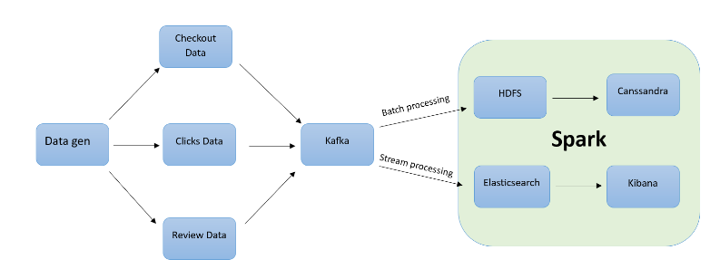

# Báo cáo BTL

Status: Finished

## Bài toán:

Lưu trữ và xử lý dữ liệu thương mại điện tử với dữ liệu check out và review sản phẩm.

## Kiến trúc hệ thống



## Dữ liệu được lưu trong Cassandra


.png)

## Spark

1. Batch Processing:
    - Spark đọc dữ liệu review sản phẩm cuối ngày từ Hadoop, thực hiện tiền xử lý dữ liệu và lưu vào Cassandra
    
    .png)
    
    - Spark đọc dữ liệu từ cassandra và tiến hành thống kê, hiển thị cho người dùng:
    
    .png)
    
2. Streaming:
    - Spark Streaming nhận dữ liệu trực tiếp từ Kafka Producer, thực hiện một số thống kê và hiển thị dữ liệu realtime cho người dùng
    
    .png)
## Install project

1. Install all package in file requirement.txt
   > pip install -r requirement.txt
2. Run docker
   > docker-compose up
   > If datanode crash to an error related to port, then change the port of datanode.
3. Enable safe mode in namenode
   > docker exec -it namenode /bin/bash 
   >
   > hdfs dfsadmin -safemode leave
   >
   > exit
4. Add hostname to C:\Windows\System32\drivers\etc\hosts.txt
   > 127.0.0.1 datanode-1
   >

5. Add folder logs in folder consumer, producer

## Run

1. Run file producer
   > for /f %i in ('python -m certifi') do set SSL_CERT_FILE=%i
   >
   > python kafka/producer/app.py
2. Run file consumer
   > python kafka/consumer/app.py

3. Run spark

   ``` copy file spark.py to spark-master ```
   >
   > docker cp spark/spark.py spark-master:/home/

   copy file analyzer.py to spark-master
   > docker cp spark/analyzer.py spark-master:/home/


   Access spark-master to run it
   >
   > docker exec -it spark-master bash
   >
   Truyền data từ hdfs lên cassandra
   >spark/bin/spark-submit --conf spark.cassandra.connection.host=casandra --packages com.datastax.spark:spark-cassandra-connector_2.12:3.3.0 --conf spark.cassandra.auth.username=cassandra --conf spark.cassandra.auth.password=cassandra --master spark-master:7077 home/hdfs_to_cassandra_review.py

   Truyền argv vào -- argv[1]: statistic / history + product_id 
   > spark/bin/spark-submit --conf spark.cassandra.connection.host=casandra --packages com.datastax.spark:spark-cassandra-connector_2.12:3.3.0 --conf spark.cassandra.auth.username=cassandra --conf spark.cassandra.auth.password=cassandra --master spark-master:7077 home/analyzer.py


   !!! kafka spark stream
   >
   > spark/bin/spark-submit --packages org.apache.spark:spark-sql-kafka-0-10_2.12:3.3.1 --master local --class "org.myspark.KafkaStream" home/stream.py
   >
